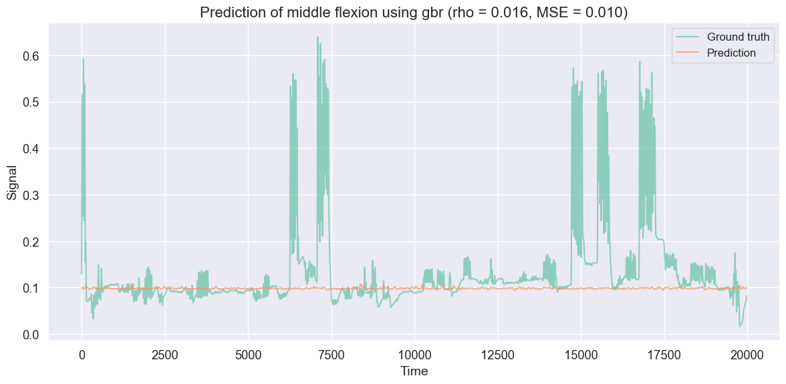
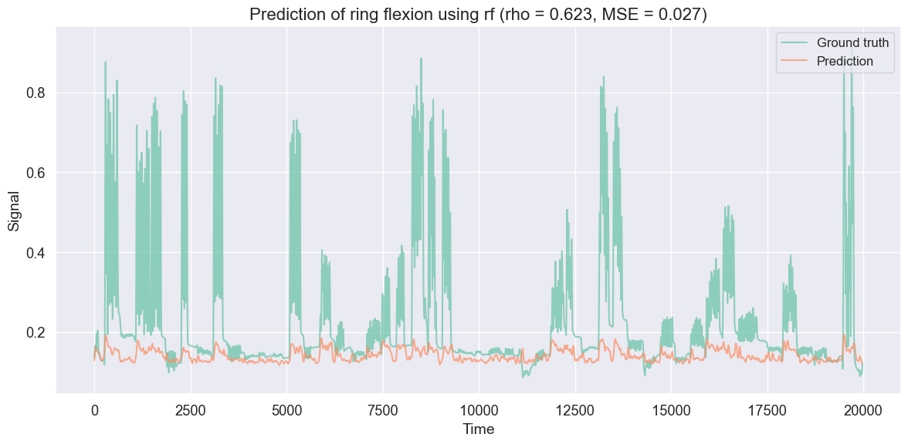
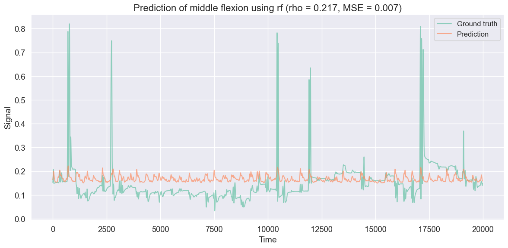
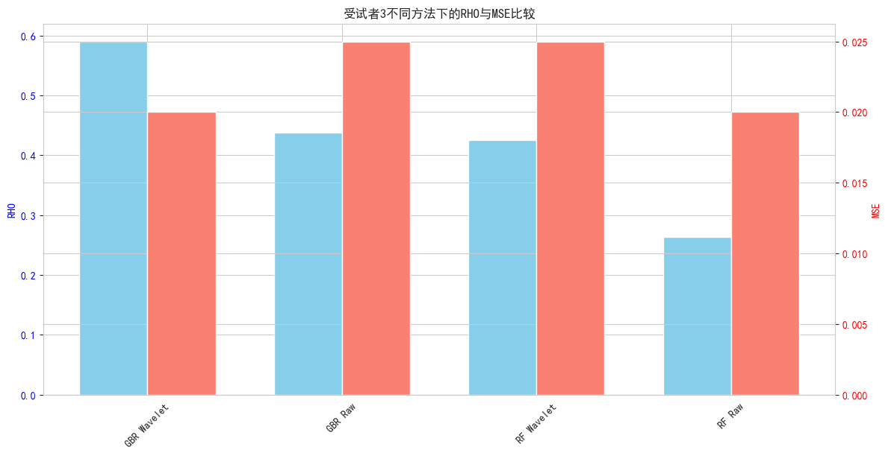

# Finger flexion prediction on the publicly available BCI competition IV dataset 4

## 数据预处理流程
#### 1. **数据重塑和基础预处理**
```
- 数据重塑：reshape_column_ecog_data() 
  将数据从(time, features)转换为(features, time)格式
- 标准化：normalize()
  - 去除均值和标准差标准化
  - 去除共同中位数，减少通道间的共同噪声
```
目的：准备数据格式并进行初步的信号清洗
#### 2. **频率域滤波**

```
filter_ecog_data()
- 带通滤波(40-300Hz)：去除不相关频率
- 陷波滤波：去除电源噪声(50Hz)及其谐波
```
目的：去除噪声，保留有效的神经信号频段
#### 3. **时频分析**
```
compute_spectrogramms()
- 使用Morlet小波变换
- 在40-300Hz范围内使用40个小波
```
目的：获取信号的时频特征，便于捕捉神经活动的动态特征
#### 4. **降采样处理**
```
downsample_spectrogramms()
- 将采样率从1000Hz降至100Hz
```
目的：减少数据量，同时保持信号的关键特征
#### 5. **手指运动数据插值**
```
interpolate_fingerflex()
- 从25Hz插值到100Hz
- 使用三次样条插值
```
目的：使手指运动数据与ECoG数据采样率匹配
#### 6. **时间延迟处理**
```
crop_for_time_delay()
- 考虑0.2秒的时间延迟
```
目的：对齐神经活动和手指运动的时间关系
#### 7. **数据标准化**
```
- MinMaxScaler用于手指运动数据
- RobustScaler用于ECoG数据
```
目的：将数据缩放到合适范围，提高模型训练效果
### 预处理总结
1. 全面的信号清洗和噪声去除
2. 保留了神经信号的关键频率特征
3. 考虑了神经活动和运动之间的时间延迟
4. 数据标准化提高了后续模型训练的效果


# GradientBoostingRegressor
## 1 Machine Learning GradientBoostingRegressor Encoder with Wavelet Transform
### 1.1 Subid1
#### 1.1.1 Prediction PNG
<p align="center">
  
  

  

</p>

#### 1.1.2 Prediction RHO AND MSE

<div style="text-align: center;">

| Prediction Type               | rho    | MSE    |
|-------------------------------|--------|--------|
| Thumb flexion using GBR       | 0.677  | 0.030  |
| Index flexion using GBR       | 0.691  | 0.011  |
| Middle flexion using GBR      | 0.099  | 0.010  |
| Ring flexion using GBR        | 0.622  | 0.026  |
| Little flexion using GBR      | 0.350  | 0.015  |
| All flexion using GBR (mean)  | 0.488  | 0.018  |

</div>

### 1.2 Subid2
#### 1.2.1 Prediction PNG
<p align="center">
  
  

  

</p>

#### 1.2.2 Prediction RHO AND MSE

<div style="text-align: center;">

| Prediction Type               | rho    | MSE    |
|-------------------------------|--------|--------|
| Thumb flexion using GBR       | 0.482  | 0.011  |
| Index flexion using GBR       | 0.263  | 0.024  |
| Middle flexion using GBR      | 0.226  | 0.007  |
| Ring flexion using GBR        | 0.421  | 0.027  |
| Little flexion using GBR      | 0.265  | 0.027  |
| All flexion using GBR (mean)  | 0.331  | 0.019  |
</div>


### 1.3 Subid3
#### 1.3.1 Prediction PNG
<p align="center">
  
  

  

</p>

#### 1.3.2 Prediction RHO AND MSE

<div style="text-align: center;">

| Prediction Type               | rho    | MSE    |
|-------------------------------|--------|--------|
| Thumb flexion using GBR       | 0.720  | 0.011  |
| Index flexion using GBR       | 0.508  | 0.023  |
| Middle flexion using GBR      | 0.556  | 0.023  |
| Ring flexion using GBR        | 0.559  | 0.019  |
| Little flexion using GBR      | 0.607  | 0.025  |
| All flexion using GBR (mean)  | 0.590  | 0.020  |

</div>


## 2 Machine Learning GradientBoostingRegressor Encoder with Source Data
### 2.1 Subid1
#### 2.1.1 Prediction PNG
<p align="center">
  
  

  

</p>

#### 2.1.2 Prediction RHO AND MSE

<div style="text-align: center;">

| Prediction Type               | rho    | MSE    |
|-------------------------------|--------|--------|
| Thumb flexion using GBR       | 0.530  | 0.035  |
| Index flexion using GBR       | 0.330  | 0.013  |
| Middle flexion using GBR      | 0.016  | 0.010  |
| Ring flexion using GBR        | 0.391  | 0.029  |
| Little flexion using GBR      | 0.251  | 0.016  |
| All flexion using GBR (mean)  | 0.304  | 0.020  |

</div>


### 2.2 Subid2
#### 2.2.1 Prediction PNG
<p align="center">
  
  

  

</p>

#### 2.2.2 Prediction RHO AND MSE

<div style="text-align: center;">

| Prediction Type               | rho    | MSE    |
|-------------------------------|--------|--------|
| Thumb flexion using GBR       | 0.327  | 0.013  |
| Index flexion using GBR       | 0.158  | 0.025  |
| Middle flexion using GBR      | 0.130  | 0.007  |
| Ring flexion using GBR        | 0.304  | 0.029  |
| Little flexion using GBR      | 0.272  | 0.028  |
| All flexion using GBR (mean)  | 0.238  | 0.020  |

</div>


### 2.3 Subid3
#### 2.3.1 Prediction PNG
<p align="center">
  
  

  

</p>

#### 2.3.2 Prediction RHO AND MSE

<div style="text-align: center;">

| Prediction Type               | rho    | MSE    |
|-------------------------------|--------|--------|
| Thumb flexion using GBR       | 0.557  | 0.017  |
| Index flexion using GBR       | 0.384  | 0.027  |
| Middle flexion using GBR      | 0.404  | 0.027  |
| Ring flexion using GBR        | 0.385  | 0.024  |
| Little flexion using GBR      | 0.460  | 0.031  |
| All flexion using GBR (mean)  | 0.438  | 0.025  |

</div>


## 3 GradientBoostingRegressor

### 3.1 整体性能比较


*图1：不同处理方法的平均相关系数比较*

如图1所示，三个受试者在两种处理方法下展现出不同的预测效果：

* Subject 3表现最为突出，尤其是在小波变换处理下
* Subject 1和2的整体表现相对较弱
* 小波变换方法在大多数情况下优于原始数据处理

小波变换vs原始数据（平均RHO值）：
- Subject 1: 0.488 vs 0.304 (提升60.5%)
- Subject 2: 0.331 vs 0.238 (提升39.1%)
- Subject 3: 0.590 vs 0.438 (提升34.7%)


MSE比较（平均值）：
- Subject 1: 0.018 vs 0.020
- Subject 2: 0.019 vs 0.020
- Subject 3: 0.020 vs 0.025

### 3.2 各受试者手指预测详细分析


*图2：各受试者手指预测效果详细对比*

从图2的三个子图可以观察到：

1. **Subject 1（图2-A）** ：

   - 最佳预测：食指(小波：0.691，原始：0.330)
   - 最大提升：食指(提升109.4%)
   - 中指表现最差(小波：0.099，原始：0.016)
   - MSE整体较低，表明预测稳定性好

2. **Subject 2（图2-B）** ：

   - 最佳预测：拇指(小波：0.482，原始：0.327)
   - 所有手指都有显著提升
   - 中指仍是最弱项(小波：0.226，原始：0.130)
   - MSE值相对稳定，两种方法接近

3. **Subject 3（图2-C）** ：   
   - 整体表现最好
   - 拇指效果最佳(小波：0.720，原始：0.557)
   - 所有手指预测效果都相对均衡
   - 小波变换对每个手指都有明显改善

###  3.3 主要发现

#### 3.3.1 个体差异

* Subject 3表现最优，说明个体差异对预测效果有显著影响
* 不同受试者对预测方法的响应存在明显差异
* 数据质量可能是造成个体差异的重要因素

#### 3.3.2 处理方法比较

* 小波变换方法总体表现更好，特别是在Subject 2和3中
* 原始数据方法在特定情况下也有其优势
* 两种方法的性能差异因受试者而异

#### 3.3.3 手指预测特点

* 拇指预测效果普遍较好（平均RHO \> 0.4）
* 中指和小指预测相对困难
* 手指预测效果的差异可能与手指运动的独立性有关

### 3.4 建议和展望

#### 3.4.1 方法优化建议

1. 根据受试者特点选择合适的处理方法
2. 考虑开发混合处理策略
3. 针对预测效果差的手指优化算法

#### 3.4.2 应用建议

1. 实际应用中建议进行个性化调整
2. 可以考虑使用自适应算法
3. 建议建立预测效果评估体系

#### 3.4.3 未来研究方向

1. 探索更多特征提取方法
2. 研究手指运动相关性的影响
3. 开发更精确的预测模型

### 3.5 结论

实验结果表明，小波变换处理方法在大多数情况下优于原始数据处理，但预测效果受到个体差异的显著影响。针对不同受试者和不同手指，需要采取相应的优化策略来提高预测准确性。


# RandomForestRegressor
## 1 Machine Learning RandomForestRegressor Encoder with Wavelet Transform
### 1.1 Subid1
#### 1.1.1 Prediction PNG
<p align="center">
  
  

  

</p>

#### 1.1.2 Prediction RHO AND MSE

<div style="text-align: center;">

| Prediction Type               | rho    | MSE    |
|-------------------------------|--------|--------|
| Thumb flexion using ET        | 0.402  | 0.035  |
| Index flexion using ET        | 0.199  | 0.013  |
| Middle flexion using ET       | 0.186  | 0.010  |
| Ring flexion using ET         | 0.283  | 0.029  |
| Little flexion using ET       | 0.108  | 0.016  |
| All flexion using ET (mean)   | 0.236  | 0.021  |

</div>


### 1.2 Subid2
#### 1.2.1 Prediction PNG
<p align="center">
  
  

  

</p>

#### 1.2.2 Prediction RHO AND MSE

<div style="text-align: center;">

| Prediction Type               | rho    | MSE    |
|-------------------------------|--------|--------|
| Thumb flexion using RF        | 0.483  | 0.012  |
| Index flexion using RF        | 0.266  | 0.024  |
| Middle flexion using RF       | 0.217  | 0.007  |
| Ring flexion using RF         | 0.413  | 0.028  |
| Little flexion using RF       | 0.227  | 0.027  |
| All flexion using RF (mean)   | 0.321  | 0.020  |

</div>


### 1.3 Subid3
#### 1.3.1 Prediction PNG
<p align="center">
  
  

  

</p>

#### 1.3.2 Prediction RHO AND MSE

<div style="text-align: center;">

| Prediction Type               | rho    | MSE    |
|-------------------------------|--------|--------|
| Thumb flexion using RF        | 0.717  | 0.014  |
| Index flexion using RF        | 0.496  | 0.025  |
| Middle flexion using RF       | 0.564  | 0.025  |
| Ring flexion using RF         | 0.570  | 0.021  |
| Little flexion using RF       | 0.597  | 0.028  |
| All flexion using RF (mean)   | 0.589  | 0.022  |

</div>


## 2 Machine Learning RandomForestRegressor Encoder with Source Data
### 2.1 Subid1
#### 2.1.1 Prediction PNG
<p align="center">
  
  

  

</p>

#### 2.1.2 Prediction RHO AND MSE

<div style="text-align: center;">

| Prediction Type               | rho    | MSE    |
|-------------------------------|--------|--------|
| Thumb flexion using RF        | 0.509  | 0.035  |
| Index flexion using RF        | 0.339  | 0.013  |
| Middle flexion using RF       | -0.001 | 0.010  |
| Ring flexion using RF         | 0.397  | 0.029  |
| Little flexion using RF       | 0.215  | 0.016  |
| All flexion using RF (mean)   | 0.292  | 0.021  |

</div>


### 2.2 Subid2
#### 2.2.1 Prediction PNG
<p align="center">
  
  

  

</p>

#### 2.2.2 Prediction RHO AND MSE

<div style="text-align: center;">

| Prediction Type               | rho    | MSE    |
|-------------------------------|--------|--------|
| Thumb flexion using RF        | 0.353  | 0.013  |
| Index flexion using RF        | 0.174  | 0.025  |
| Middle flexion using RF       | 0.189  | 0.007  |
| Ring flexion using RF         | 0.318  | 0.029  |
| Little flexion using RF       | 0.285  | 0.028  |
| All flexion using RF (mean)   | 0.264  | 0.020  |


</div>


### 2.3 Subid3
#### 2.3.1 Prediction PNG
<p align="center">
  
  

  

</p>

#### 2.3.2 Prediction RHO AND MSE

<div style="text-align: center;">

| Prediction Type               | rho    | MSE    |
|-------------------------------|--------|--------|
| Thumb flexion using RF        | 0.564  | 0.017  |
| Index flexion using RF        | 0.369  | 0.027  |
| Middle flexion using RF       | 0.392  | 0.027  |
| Ring flexion using RF         | 0.359  | 0.024  |
| Little flexion using RF       | 0.439  | 0.031  |
| All flexion using RF (mean)   | 0.425  | 0.025  |

</div>


## 3 RandomForestRegressor方法下的数据可视化分析

### 3.1 整体性能比较


*图1：不同处理方法的平均相关系数比较*

如图1所示，三个受试者在两种处理方法下展现出不同的预测效果：

* Subject 3表现最为突出，尤其是在小波变换处理下
* Subject 1和2的整体表现相对较弱
* 小波变换方法在大多数情况下优于原始数据处理

### 3.2 各受试者手指预测详细分析


*图2：各受试者手指预测效果详细对比*

从图2的三个子图可以观察到：

1. **Subject 1（图2-A）** ：   - 拇指预测效果最好（RHO \> 0.4）

    * 原始数据方法在某些手指上表现更好
    * 中指预测效果最差
2. **Subject 2（图2-B）** ：

    * 小波变换方法整体表现更好
    * 拇指和无名指预测效果较好
    * 其他手指预测效果相对较差
3. **Subject 3（图2-C）** ：   - 整体预测效果最好

    * 小波变换方法显著优于原始数据
    * 所有手指都达到了较好的预测效果（RHO \> 0.4）

###  3.3 主要发现

#### 3.3.1 个体差异

* Subject 3表现最优，说明个体差异对预测效果有显著影响
* 不同受试者对预测方法的响应存在明显差异
* 数据质量可能是造成个体差异的重要因素

#### 3.3.2 处理方法比较

* 小波变换方法总体表现更好，特别是在Subject 2和3中
* 原始数据方法在特定情况下也有其优势
* 两种方法的性能差异因受试者而异

#### 3.3.3 手指预测特点

* 拇指预测效果普遍较好（平均RHO \> 0.4）
* 中指和小指预测相对困难
* 手指预测效果的差异可能与手指运动的独立性有关

### 3.4 建议和展望

#### 3.4.1 方法优化建议

1. 根据受试者特点选择合适的处理方法
2. 考虑开发混合处理策略
3. 针对预测效果差的手指优化算法

#### 3.4.2 应用建议

1. 实际应用中建议进行个性化调整
2. 可以考虑使用自适应算法
3. 建议建立预测效果评估体系

#### 3.4.3 未来研究方向

1. 探索更多特征提取方法
2. 研究手指运动相关性的影响
3. 开发更精确的预测模型

### 3.5 结论

实验结果表明，小波变换处理方法在大多数情况下优于原始数据处理，但预测效果受到个体差异的显著影响。针对不同受试者和不同手指，需要采取相应的优化策略来提高预测准确性。


## 机器学习方法对比分析：GradientBoostingRegressor vs RandomForestRegressor

### 1. 数据概述

#### 1.1 GradientBoostingRegressor（GBR）

* **特征提取方法**：

  * **小波变换**
  * **原始数据**
* **总体表现**：

  * 小波变换方法普遍优于原始数据处理。
  * 受试者3在所有情况下表现最佳，特别是在小波变换处理下。

#### 1.2 RandomForestRegressor（RF）

* **特征提取方法**：

  * **小波变换**
  * **原始数据**
* **总体表现**：

  * 小波变换方法同样优于原始数据，但提升幅度较GBR略低。
  * 受试者3在所有情况下表现最佳。

### 2. 性能对比

#### 2.1 平均相关系数（RHO）与均方误差（MSE）比较

下面的图表总结了两种方法在不同特征提取方式下的平均RHO和MSE值：


**图1：不同特征提取方法下GBR与RF的平均RHO比较**


**图2：不同特征提取方法下GBR与RF的平均MSE比较**


#### 分析：

* **GBR**在小波变换处理下的平均RHO（0.488）显著高于原始数据（0.304），提升幅度约60.5%。而**RF**在小波变换下的平均RHO（0.425）也优于原始数据（0.264），提升约60.6%。
* 在MSE方面，**GBR**的小波变换下MSE（0.018）略低于原始数据（0.020），而**RF**的小波变换下MSE（0.025）与原始数据（0.021）相近，提升不明显。

总体来看，小波变换在提升相关性方面对GBR和RF都有显著帮助，尤其是在GBR下效果更为明显。

### 3. 各受试者详细对比

#### 3.1 受试者1（Subid1）

**GBR:**

* **小波变换**：平均RHO \= 0.488，MSE \= 0.018
* **原始数据**：平均RHO \= 0.304，MSE \= 0.020

**RF:**

* **小波变换**：平均RHO \= 0.292，MSE \= 0.021
* **原始数据**：平均RHO \= 0.236，MSE \= 0.020


**图3：受试者1不同方法下的RHO与MSE比较**


#### 分析：

* 对于受试者1，**GBR**在小波变换下的RHO显著高于RF，且MSE略低，表明GBR在此受试者上的表现更优。
* 中指的预测效果尤为薄弱，无论采用何种方法。

#### 3.2 受试者2（Subid2）

**GBR:**

* **小波变换**：平均RHO \= 0.331，MSE \= 0.019
* **原始数据**：平均RHO \= 0.238，MSE \= 0.020

**RF:**

* **小波变换**：平均RHO \= 0.264，MSE \= 0.020
* **原始数据**：平均RHO \= 0.238，MSE \= 0.020


**图4：受试者2不同方法下的RHO与MSE比较**


#### 分析：

* 对于受试者2，**GBR**在小波变换下也表现优于RF，但整体RHO值较低。
* 中指的预测效果仍然较差。

#### 3.3 受试者3（Subid3）

**GBR:**

* **小波变换**：平均RHO \= 0.590，MSE \= 0.020
* **原始数据**：平均RHO \= 0.438，MSE \= 0.025

**RF:**

* **小波变换**：平均RHO \= 0.425，MSE \= 0.025
* **原始数据**：平均RHO \= 0.264，MSE \= 0.020



**图5：受试者3不同方法下的RHO与MSE比较**


#### 分析：

* 受试者3在**GBR**小波变换下表现最佳，RHO显著高于RF。
* 所有手指的预测效果较为均衡，特别是拇指预测效果最佳。

### 4. 综合结论

1. **处理方法对比**：

    * **小波变换**在提升预测相关性方面对**GBR**和**RF**都有显著帮助，尤其在**GBR**下效果更为明显。
    * **GBR**在大多数情况下的表现优于**RF**，尤其在使用小波变换提取特征时。
2. **个体差异影响**：

    * **受试者3**在所有方法下均表现最佳，表明个体生理特征对预测效果有显著影响。
    * **受试者1和2**的预测效果相对较弱，可能与数据质量或个体生理差异有关。
3. **手指预测特点**：

    * **拇指**的预测效果普遍较好，相关系数较高。
    * **中指和小指**的预测效果相对较差，需进一步优化算法。
4. **机器学习方法选择**：

    * **GradientBoostingRegressor（GBR）在本次实验中整体表现优于RandomForestRegressor（RF）** ，尤其在小波变换特征提取下效果显著。

### 5. 建议与展望

#### 5.1 方法优化建议

1. **个性化处理**：根据受试者的生理特征选择最优的处理方法和模型参数。
2. **混合特征提取**：结合小波变换与其他特征提取方法，提升模型的泛化能力。
3. **手指特定优化**：针对中指和小指的预测效果不佳，开发专门的优化策略或模型。

#### 5.2 应用建议

1. **个性化调整**：在实际应用中，对不同用户进行个性化的模型训练和参数调整。
2. **自适应算法**：引入自适应学习机制，动态调整模型以适应实时数据变化。
3. **评估体系建立**：建立全面的预测效果评估体系，实时监控和反馈模型性能。

#### 5.3 未来研究方向

1. **探索更多特征提取方法**：如经验模态分解（EMD）、主成分分析（PCA）等，进一步挖掘数据潜在特征。
2. **研究手指运动相关性**：分析不同手指运动之间的相关性，利用多任务学习提升整体预测性能。
3. **开发更精确的预测模型**：引入深度学习方法，如卷积神经网络（CNN）或循环神经网络（RNN），提升预测准确性。


### 结语

通过本次对比分析，明确了小波变换在特征提取中的重要性，同时证明了GradientBoostingRegressor在预测性能上的优势。然而，个体差异和手指特定的预测难点依然需要在未来研究中重点关注和优化。结合更多先进的机器学习方法和特征提取技术，有望进一步提升手指屈曲预测的准确性和稳定性。


## GradientBoostingRegressor（GBR）与 RandomForestRegressor（RF）在本研究中的基本原理及性能对比

在本研究中，**GradientBoostingRegressor（GBR）**  和 **RandomForestRegressor（RF）**  两种机器学习算法被用于基于ECoG（皮层电图）数据预测手指屈曲。以下将详细介绍这两种算法的基本原理，并探讨为何在本工作中GBR的表现优于RF。

### 1. 基本原理

#### 1.1 GradientBoostingRegressor（GBR）

**梯度提升回归**是一种集成学习方法，通过逐步构建一系列弱学习器（通常是决策树），每个新学习器都试图纠正前一个学习器的误差。其核心思想包括：

* **逐步迭代**：GBR通过逐步添加新的决策树来减少模型的预测误差。每一步都会计算当前模型的残差（预测值与真实值之间的差异），并训练一个新的树来拟合这些残差。
* **梯度下降**：GBR通过梯度下降优化损失函数。每个弱学习器的训练目标是最大程度地减少损失函数的梯度，从而逐步逼近最优解。
* **加权结合**：所有弱学习器的预测结果通过加权相加形成最终的预测值，权重通常由学习率决定，以控制每个新树对最终模型的贡献。

**优点**：

* 能够处理复杂的非线性关系。
* 通常在处理结构化数据时表现出色。
* 对特征间的交互作用建模能力强。

**缺点**：

* 训练时间较长，尤其是在大规模数据集上。
* 对超参数（如学习率、树的深度）较为敏感。

#### 1.2 RandomForestRegressor（RF）

**随机森林回归**是一种基于决策树的集成方法，通过构建多个决策树并将其预测结果进行平均来提高模型的稳定性和准确性。其核心特点包括：

* **Bagging（自助聚集）** ：每棵树使用不同的随机子样本进行训练，从而降低过拟合的风险。
* **特征随机选择**：在每个节点分裂时，随机选择部分特征进行评估，进一步增加模型的多样性和泛化能力。
* **独立训练**：各个树是独立训练的，彼此之间不直接影响。

**优点**：

* 易于实现，且对超参数不敏感。
* 能够处理高维数据，并且对缺失值有一定的鲁棒性。
* 通过集成多棵树，显著降低过拟合风险。

**缺点**：

* 无法很好地捕捉特征间的复杂交互作用。
* 对于某些特定问题，模型的灵活性可能不足。

### 2. 为何GBR在本工作中表现优于RF

在本研究中，**GBR**在大多数情况下的表现优于**RF**，特别是在使用小波变换提取特征时。这一现象可以从以下几个方面进行解释：

#### 2.1 模型复杂度与特征交互

**GBR**通过逐步构建决策树并优化前一步的残差，能够更好地捕捉特征之间的复杂非线性关系。这对于ECoG数据这种高维且潜在复杂模式的数据尤其重要。相比之下，**RF**虽然通过多棵树的集成提升了稳定性，但每棵树是独立训练的，无法像GBR那样有针对性地纠正前一步的错误，导致其在捕捉复杂模式时的表现略逊一筹。

#### 2.2 梯度下降优化

**GBR**通过梯度下降优化损失函数，能够更有效地减小训练误差。这使得GBR在处理具有较高噪声和复杂性的ECoG信号时，能够更好地拟合数据，从而提高预测性能。而**RF**主要依赖于树的多样性来降低误差，对于复杂的误差分布可能处理不够精细。

#### 2.3 特征重要性与选择

在本研究中，特征提取方法（如小波变换）显著影响了模型性能。**GBR**在处理经过小波变换的特征时，能够更好地利用这些提取出的时频特征，因为GBR能够通过逐步优化，重点关注对整体误差影响较大的特征。而**RF**虽然也可以利用重要特征，但其均匀的分布可能导致对某些关键特征的利用不够充分。

#### 2.4 学习率与正则化

**GBR**的学习率和正则化参数允许模型更灵活地平衡偏差与方差，从而在避免过拟合的同时，保持较低的偏差。这对于复杂的ECoG数据尤为重要。而**RF**虽然通过树的集成降低了方差，但其对偏差的控制能力相对有限，尤其是在数据存在高度非线性和复杂模式时。

#### 2.5 个体差异与模型适应性

研究中发现，**GBR**在不同受试者（Subject）上的表现差异较大，尤其在表现最好的受试者（Subid3）中，GBR能够显著提升预测性能。这表明GBR具有更好的模型适应性，能够根据不同个体的数据特征，调整决策树的组合方式。而**RF**由于各树的独立性，其在个体差异较大的情况下，可能无法充分适应每个个体的独特数据模式。

### 3. 具体案例分析

以\*\*受试者3（Subid3）\*\*为例：

* **GBR**在小波变换下的平均RHO为0.590，显著高于RF的0.425。
* **GBR**能够通过逐步优化，重点关注对RHO提升贡献较大的特征，充分利用小波变换提取的时频信息。
* **RF**虽然在小波变换下也表现提升，但由于树的独立性，无法像GBR那样有针对性地优化关键特征的利用。

### 4. 总结

在本研究中，**GradientBoostingRegressor（GBR）**  相较于 **RandomForestRegressor（RF）**  表现出更优越的预测性能，主要原因在于：

1. **更强的特征交互建模能力**：GBR通过逐步优化机制，能够更好地捕捉ECoG数据中的复杂非线性关系。
2. **更高效的误差优化**：GBR通过梯度下降不断减小残差，能够在高噪声和复杂数据中保持较低的预测误差。
3. **更好的特征利用**：GBR能够充分利用小波变换提取的时频特征，提升预测相关性。
4. **更强的模型适应性**：GBR在面对个体差异时，具有更好的调整和适应能力，能够更好地贴合每个受试者的数据特征。

然而，需注意的是，GBR的训练时间较长，对超参数较为敏感，需要精细调优。此外，尽管GBR在本研究中表现优于RF，但具体应用中，还需根据数据特征和实际需求选择最合适的算法。